# AI Usage Stats

Turn GitHub Copilot **AI Usage Report** CSV exports into a clear, interactive
dashboard that shows *who* is using *which* models, *how much* they cost, and
*where* spend is heading.

A single, self-contained script ([generate_dashboard.py](generate_dashboard.py))
reads the CSV exports and produces one interactive `dashboard.html`
(pan / zoom / hover / legend) powered by [Bokeh](https://bokeh.org/).

## Features

- Most popular models — by credits and by usage records
- Top users by credits and by cost (gross vs. net)
- Daily usage over time (credits and active users)
- Model / model-family usage trends (stacked areas)
- Monthly net-spend projection with run-rate and a configurable cost offset
- Weekday × model heatmap and credit/family pie charts
- Auto-selected vs. manually chosen model split
- Automatic de-duplication of overlapping report files
- Optional **anonymization** of usernames (with a private key file)

## Quick start

```bash
pip install -r requirements.txt

# Generate the interactive dashboard from every *.csv in the current folder
python generate_dashboard.py
```

### Try it with demo data

No real report handy? Generate a synthetic one and build a dashboard from it:

```bash
python demo/generate_demo_data.py                  # writes demo/data/ai_usage_report.csv
python generate_dashboard.py -i demo/data -o demo/demo_dashboard.html
```

Open `demo/demo_dashboard.html` in a browser to explore (or screenshot) the
result. The demo data is entirely fictional.

## Plots

The dashboard is a single scrolling page combining all of the panels below.
Each plot is interactive (pan / zoom / hover / legend) in the live HTML; the
images here are rendered from the demo data.

### Most popular models (by credits)

Which models consume the most AI credits — the heaviest cost drivers.

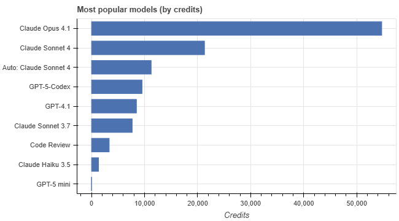

### Most popular models (by usage records)

Which models are invoked most often, regardless of how many credits each call
costs.

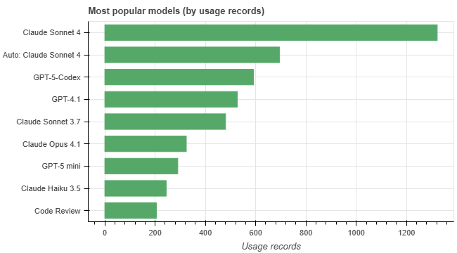

### Most active days of the week

How credit usage is distributed across the days of the week (weekends
highlighted).

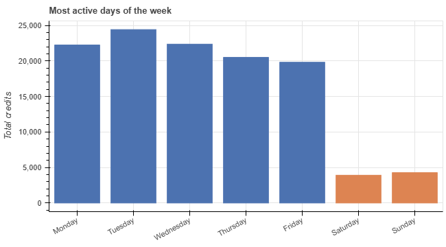

### Distribution of credits per usage record

How credits-per-record are distributed — separating many cheap calls from a
few expensive ones.

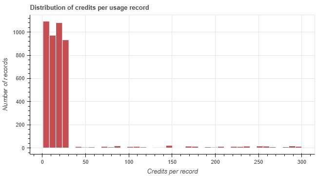

### Daily usage over time

Daily AI credits consumed and the number of active users over time.

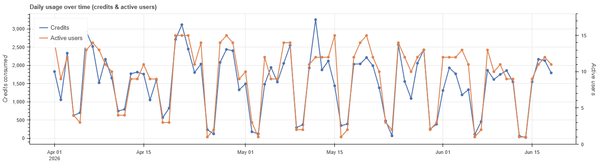

### Model usage over time

How each model's share of daily usage (by record count) evolves over time.

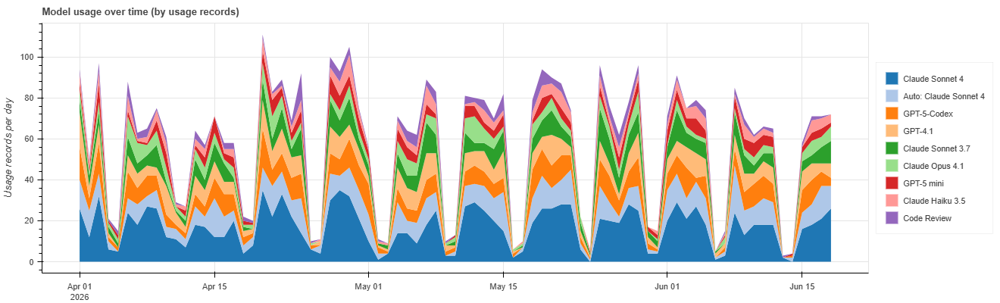

### Model family usage over time

How each model family's share of daily usage (by record count) evolves over
time.

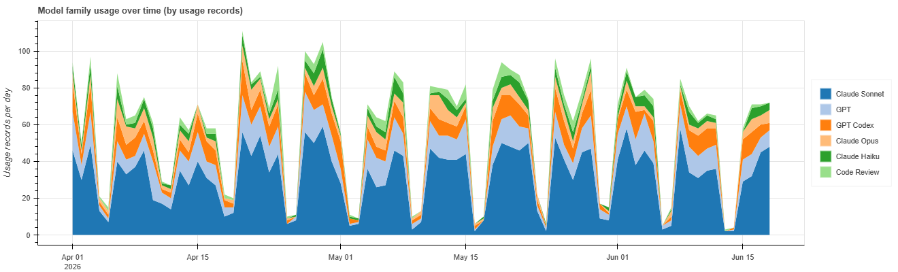

### Monthly net-spend projection

Month-to-date cumulative spend with a run-rate projection to month-end,
including the optional base-fee offset, spending cap and cap-crossing marker.

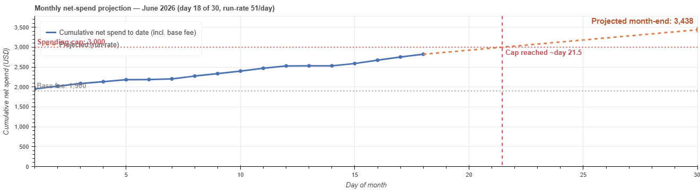

### Top users (by credits and by cost)

Which users consume the most credits, and which cost the most (gross vs. net
post-discount spend).

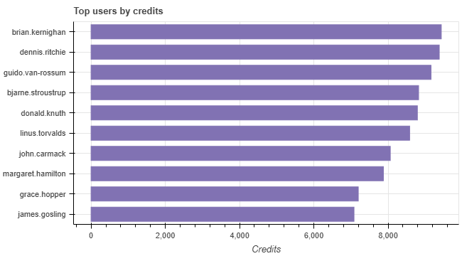

### Top usage records

The single largest usage records by credits — the biggest individual calls and
who made them.

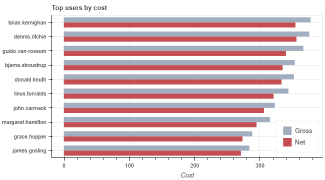

### Model usage by day of week

Credit usage for the top models broken down by day of the week.

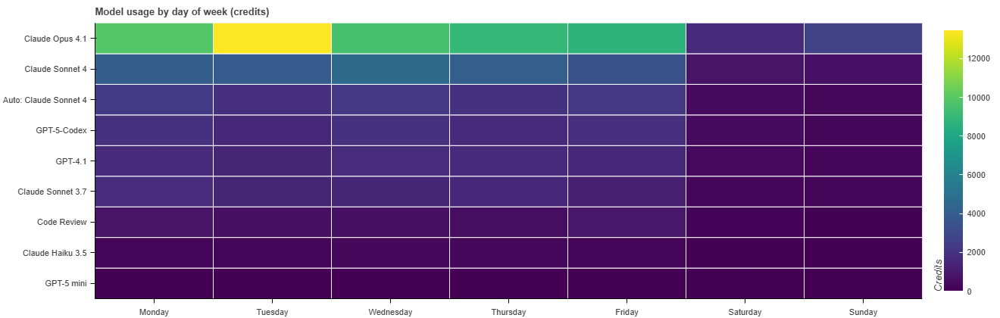

### Share by model family

Share of total credits and of usage records by model family.

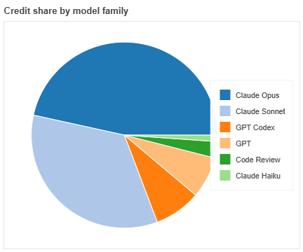
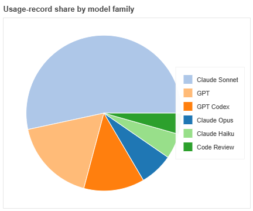

### Auto-selected vs. manually chosen

Credits from auto-selected vs. manually chosen models.

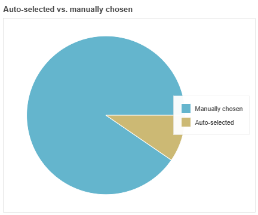

## Usage

```bash
python generate_dashboard.py \
    --input ./reports \        # CSV file, directory, or glob (default: current dir)
    --output dashboard.html \  # output HTML file
    --top 15 \                 # items shown in "top N" charts (default: 10)
    --monthly-offset 1900 \    # flat fee added to the spend projection (default: 0)
    --spending-cap 5000 \      # draw a monthly cap line + crossing marker (default: none)
    --anonymize                # replace usernames with stable pseudonyms
```

The `--monthly-offset` value is a flat amount (e.g. a base plan fee) added on
top of the metered net spend in the monthly projection. It does not affect the
per-day run-rate. It defaults to `0`.

The `--spending-cap` value draws a horizontal line at the given monthly cap on
the spend-projection chart, plus a vertical line marking the day the projected
spend crosses it (with a note if the cap isn't reached this month). Off by
default.

## Input data format

The scripts read GitHub Copilot AI Usage Report CSV files. Each row is one
usage record; multiple/overlapping exports are de-duplicated automatically.
Expected columns:

```
date, username, product, sku, model, organization, repository,
cost_center_name, quantity, applied_cost_per_quantity, gross_amount,
discount_amount, net_amount, total_monthly_quota, aic_quantity, aic_gross_amount
```

`quantity` is the number of credits, `net_amount` is the amount actually
billed. Model families (Claude Opus/Sonnet/Haiku, GPT, GPT Codex, Code Review)
and the auto-selected flag are derived from the `model` name. See
[demo/generate_demo_data.py](demo/generate_demo_data.py) for a complete, valid example.

## Anonymization

`--anonymize` replaces each username with a stable pseudonym (`User 01`,
`User 02`, …) ranked by credits, and writes an `anonymization_key.csv` mapping
file next to the output so authorized owners can reverse it. Keep that key
file private.

## Requirements

Python 3.9+ and the packages in [requirements.txt](requirements.txt)
(`pandas`, `numpy`, `bokeh`).

## License

Released into the public domain under the [Unlicense](LICENSE).

## AI assistance

This tool was developed with the assistance of AI.
